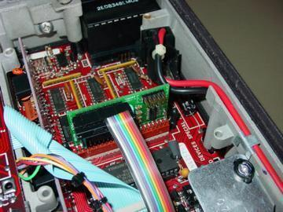
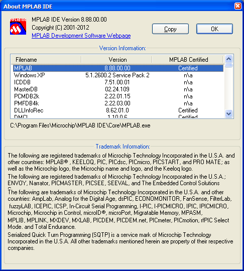

# PIC bootloader used on Xcat Syntor X code plug replacement project

https://github.com/skiphansen/xcat_ldr

## What is this?

The Xcat was a PIC based device that replaced the Motorola Syntor X radios
"code plug" to provide frequency agility for Ham radio operators.

For more information about Xcats visit the Xcat group on [groups.io](https://groups.io/g/xcat)

The project consists of
- [Xcat PC control program](https://github.com/skiphansen/xcat_pc)
- [Xcat firmware](https://github.com/skiphansen/xcat_fw)
- [Xcat booloader](https://github.com/skiphansen/xcat_ldr)

This the bootloader that was used on the PIC16F877A based Xcat Syntor X code 
plug replacement project.

This program was originally written in 2004 and hasn't been touched since 
July 2007. 

I've put this on github as a history preservation project.

For more information about Xcats visit the Xcat group on [groups.io](https://groups.io/g/xcat)

## Building

1. Install MPLAB IDE version 8.88.0.00 (2012)  

The loader is a single assembly language source file and a linker script, it
shouldn't be too hard to create a new project for a current IDE. I tried a
version of MPLAB X from 2016, but it didn't know how to open an .mcp project.

2. Clone this repository.

3. Change directory into xcat_ldr

4. Open picldr.mcp

5. Select "Rebuild All" from the Build menu

